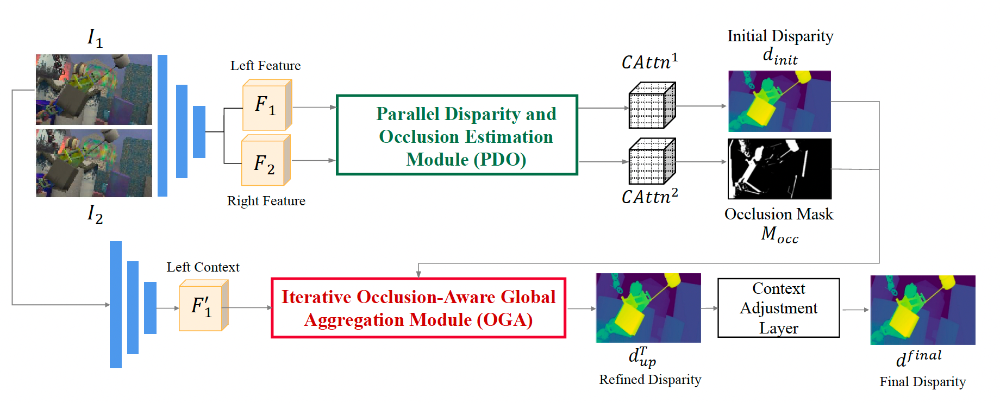

# GOAT: Global Occlusion-Aware Transformer for Robust Stereo Matching

[](https://openaccess.thecvf.com/content/WACV2024/papers/Liu_Global_Occlusion-Aware_Transformer_for_Robust_Stereo_Matching_WACV_2024_paper.pdf)
[](http://www.ok.sc.e.titech.ac.jp/res/DeepSM/wacv2024.html)
[](https://www.bilibili.com/video/BV1Va4y167Pj/)

> **Global Occlusion-Aware Transformer for Robust Stereo Matching**    
> WACV 2024

<div align="center">
  
</div>

## 📋 Table of Contents

- [Overview](#overview)
- [Features](#features)
- [Installation](#installation)
- [Project Structure](#project-structure)
- [Dataset Preparation](#dataset-preparation)
- [Training](#training)
- [Citation](#citation)
- [Acknowledgements](#acknowledgements)
- [License](#license)

## 🎯 Overview

GOAT (Global Occlusion-Aware Transformer) is a robust stereo matching network that achieves state-of-the-art performance on multiple benchmarks. The network features:

- **Global Context Modeling**: Transformer-based architecture for capturing long-range dependencies
- **Occlusion Awareness**: Explicit occlusion detection and handling mechanism
- **Multi-Scale Processing**: Pyramid cost volume construction for robust matching
- **Model Architecture**: GOAT-T (Tiny) optimized for accuracy and efficiency

## ✨ Features

- ✅ Global attention mechanism for robust feature matching
- ✅ Occlusion-aware design for handling challenging scenarios
- ✅ Support for multiple datasets: SceneFlow, KITTI, MiddleBurry, ETH3D, FAT
- ✅ Distributed training (DDP) support
- ✅ TensorBoard integration for training visualization
- ✅ Flexible loss configuration
- ✅ Comprehensive evaluation metrics (EPE, P1-Error, mIOU)

## 🔧 Installation

### Prerequisites

- Python >= 3.7
- PyTorch >= 1.7.0
- CUDA >= 10.2 (for GPU support)
- GCC >= 5.4 (for building deformable convolution)

### Quick Setup

**Step 1:** Clone the repository
```bash
git clone git@github.com:Magicboomliu/GOAT.git
cd GOAT
```

**Step 2:** Create and activate conda environment
```bash
conda create -n goat python=3.8
conda activate goat
```

**Step 3:** Install PyTorch
```bash
# For CUDA 11.0
pip install torch==1.7.0+cu110 torchvision==0.8.0+cu110 -f https://download.pytorch.org/whl/torch_stable.html

# Or for CUDA 10.2
pip install torch==1.7.0+cu102 torchvision==0.8.0+cu102 -f https://download.pytorch.org/whl/torch_stable.html
```

**Step 4:** Install dependencies
```bash
pip install -r requirements.txt
```

**Step 5:** Install GOAT package
```bash
pip install -e .
```

**Step 6:** Build Deformable Convolution (Optional)
```bash
cd third_party/deform
bash make.sh
cd ../..
```

> **Note:** Deformable convolution is optional. The model works without it, but may achieve slightly better performance with it enabled via `--use_deform` flag.

### Verify Installation

```bash
# Test imports
python -c "import goat; from goat.models.networks.Methods.GOAT_T import GOAT_T; print('Installation successful!')"

# Check GPU availability
python -c "import torch; print(f'CUDA available: {torch.cuda.is_available()}, GPU count: {torch.cuda.device_count()}')"
```

## 📂 Project Structure

The repository is organized as follows:

```
GOAT/
├── goat/              # Main source package (models, losses, utilities)
├── data/              # Dataloaders and dataset file lists
├── scripts/           # Training and evaluation scripts
├── configs/           # Configuration files
├── third_party/       # External dependencies (deformable convolution)
├── docs/              # Documentation and assets
└── tests/             # Unit tests (future)
```

**Key directories:**
- **`goat/models/`**: Network architectures (GOAT-T, GOAT-L, attention modules, etc.)
- **`goat/losses/`**: Loss functions for training
- **`goat/utils/`**: Utility functions and metrics
- **`data/dataloaders/`**: Dataset loaders for KITTI, SceneFlow, MiddleBurry, ETH3D, FAT
- **`data/filenames/`**: Dataset file lists organized by dataset type
- **`scripts/`**: Executable training scripts

For a detailed structure guide, see [STRUCTURE.md](STRUCTURE.md).

**📋 Quick Links:**
- 🚀 [Quick Start Guide](QUICKSTART.md) - Get started in 5 minutes
- ✅ [GPU Ready Checklist](GPU_READY_CHECKLIST.md) - Verify code is ready to run
- 🔍 [Verification Report](VERIFICATION_REPORT.md) - Complete verification details
- 🔄 [Migration Guide](MIGRATION_GUIDE.md) - Update existing code

## 📊 Dataset Preparation

### SceneFlow Dataset

1. Download the [SceneFlow](https://lmb.informatik.uni-freiburg.de/resources/datasets/SceneFlowDatasets.en.html) dataset
2. Organize the data structure as:
```
/path/to/sceneflow/
├── frames_cleanpass/
├── frames_finalpass/
└── disparity/
```

3. Update the dataset path in training script:
```bash
--datapath /path/to/sceneflow
```

### KITTI Dataset

1. Download [KITTI 2012](http://www.cvlibs.net/datasets/kitti/eval_stereo_flow.php?benchmark=stereo) and/or [KITTI 2015](http://www.cvlibs.net/datasets/kitti/eval_scene_flow.php?benchmark=stereo)
2. Organize as:
```
/path/to/kitti/
├── 2012/
│   ├── training/
│   └── testing/
└── 2015/
    ├── training/
    └── testing/
```

### Other Datasets

See `data/filenames/` directory for supported datasets:
- MiddleBurry
- ETH3D
- FAT (Flying Automotive Things)

## 🚀 Training

### Quick Start

**Prepare your dataset first** (see [Dataset Preparation](#dataset-preparation)), then run:

```bash
# Create necessary directories
mkdir -p models_saved logs experiments_logdir

# Single GPU training (recommended to test first)
python scripts/train.py \
    --cuda \
    --model GOAT_T_Origin \
    --loss configs/loss_config_disp.json \
    --lr 1e-3 \
    --batch_size 4 \
    --dataset sceneflow \
    --trainlist data/filenames/SceneFlow/SceneFlow_With_Occ.list \
    --vallist data/filenames/SceneFlow/FlyingThings3D_Test_With_Occ.list \
    --datapath /path/to/sceneflow \
    --outf models_saved/goat_experiment \
    --logFile logs/train.log \
    --save_logdir experiments_logdir/goat_experiment \
    --devices 0 \
    --local_rank 0 \
    --datathread 4 \
    --manualSeed 1024
```

### Multi-GPU Training (Recommended)

For faster training, use distributed data parallel (DDP) with multiple GPUs:

```bash
# 2 GPUs
CUDA_VISIBLE_DEVICES=0,1 python -m torch.distributed.launch \
    --nproc_per_node=2 \
    scripts/train.py \
    --cuda \
    --model GOAT_T_Origin \
    --loss configs/loss_config_disp.json \
    --lr 1e-3 \
    --batch_size 2 \
    --dataset sceneflow \
    --trainlist data/filenames/SceneFlow/SceneFlow_With_Occ.list \
    --vallist data/filenames/SceneFlow/FlyingThings3D_Test_With_Occ.list \
    --datapath /path/to/sceneflow \
    --outf models_saved/goat_experiment \
    --logFile logs/train.log \
    --save_logdir experiments_logdir/goat_experiment \
    --devices 0,1 \
    --datathread 4 \
    --manualSeed 1024

# 4 GPUs (adjust batch_size and nproc_per_node accordingly)
CUDA_VISIBLE_DEVICES=0,1,2,3 python -m torch.distributed.launch \
    --nproc_per_node=4 \
    scripts/train.py \
    --cuda \
    --model GOAT_T_Origin \
    --loss configs/loss_config_disp.json \
    --lr 1e-3 \
    --batch_size 1 \
    --dataset sceneflow \
    --trainlist data/filenames/SceneFlow/SceneFlow_With_Occ.list \
    --vallist data/filenames/SceneFlow/FlyingThings3D_Test_With_Occ.list \
    --datapath /path/to/sceneflow \
    --outf models_saved/goat_experiment \
    --logFile logs/train.log \
    --save_logdir experiments_logdir/goat_experiment \
    --devices 0,1,2,3 \
    --datathread 4 \
    --manualSeed 1024
```

### Using the Training Script

Modify and use the provided shell script:

```bash
# 1. Edit scripts/train.sh and update these variables:
#    - datapath: path to your dataset
#    - pretrain_name: experiment name
#    - Other parameters as needed

# 2. Run the script
bash scripts/train.sh
```

### Training Arguments

**Required Arguments:**

| Argument | Description | Example |
|----------|-------------|---------|
| `--cuda` | Enable CUDA | (flag, no value) |
| `--model` | Model architecture | `GOAT_T_Origin` |
| `--loss` | Loss configuration file | `configs/loss_config_disp.json` |
| `--dataset` | Dataset name | `sceneflow` |
| `--trainlist` | Training file list | `data/filenames/SceneFlow/SceneFlow_With_Occ.list` |
| `--vallist` | Validation file list | `data/filenames/SceneFlow/FlyingThings3D_Test_With_Occ.list` |
| `--datapath` | Dataset root path | `/path/to/sceneflow` |
| `--outf` | Output directory for models | `models_saved/experiment_name` |
| `--logFile` | Log file path | `logs/train.log` |
| `--save_logdir` | TensorBoard log directory | `experiments_logdir/experiment_name` |
| `--devices` | GPU device IDs | `0` or `0,1,2,3` |
| `--local_rank` | Local rank (DDP) | Auto-set by launcher |
| `--datathread` | Number of data loading workers | `4` |

**Optional Arguments:**

| Argument | Description | Default |
|----------|-------------|---------|
| `--net` | Legacy network name | `simplenet` |
| `--lr` | Learning rate | `0.0002` |
| `--batch_size` | Batch size per GPU | `8` |
| `--test_batch` | Test batch size | `4` |
| `--maxdisp` | Maximum disparity | `-1` (auto) |
| `--pretrain` | Path to pretrained model | `none` |
| `--initial_pretrain` | Partial weight loading | `none` |
| `--use_deform` | Use deformable convolution | `False` |
| `--startRound` | Start training round | `0` |
| `--startEpoch` | Start epoch | `0` |
| `--manualSeed` | Random seed | Random |
| `--workers` | Number of workers | `8` |
| `--momentum` | SGD momentum | `0.9` |
| `--beta` | Adam beta | `0.999` |

**With Deformable Convolution:**
```bash
# First build deformable convolution (see Installation)
python scripts/train.py \
    --use_deform \
    ... other arguments ...
```


**Tracked Metrics:**
- Total loss (combined disparity + occlusion loss)
- Disparity sequence loss
- Occlusion loss
- Disparity EPE (End-Point Error)
- Occlusion EPE
- Occlusion mIOU (mean Intersection over Union)
- P1-Error (percentage of pixels with >1px error)
- Learning rate

**Model Checkpoints:**
Models are automatically saved in the `--outf` directory:
- `{net}_{round}_{epoch}_{EPE}.pth` - Regular checkpoints
- `model_best.pth` - Best model based on validation EPE
- `checkpoint.pth` - Latest checkpoint

**Training Schedule:**
The learning rate schedule (defined in `goat/trainer.py`):
- Epochs 0-10: 3e-4
- Epochs 11-39: 1e-4
- Epochs 40-49: 5e-5
- Epochs 50-59: 3e-5
- Epochs 60+: 1.5e-5

## 📊 Dataset Information

### Supported Datasets

| Dataset | Type | Training Samples | Test Samples | Resolution | Usage |
|---------|------|------------------|--------------|------------|-------|
| SceneFlow | Synthetic | ~35K | ~4K | Variable | Pre-training |
| KITTI 2015 | Real-world | 200 | 200 | 1242×375 | Fine-tuning/Eval |
| KITTI 2012 | Real-world | 194 | 195 | 1242×375 | Fine-tuning/Eval |
| MiddleBurry | Real-world | ~100 | ~15 | Variable | Evaluation |
| ETH3D | Real-world | 27 | 20 | Variable | Evaluation |
| FAT | Synthetic | ~35K | ~5K | Variable | Training/Eval |

### File Lists

All dataset file lists are in `data/filenames/`:
```
data/filenames/
├── SceneFlow/
│   ├── SceneFlow_With_Occ.list        # Training with occlusion
│   └── FlyingThings3D_Test_With_Occ.list  # Validation with occlusion
├── KITTI/
│   ├── KITTI_mix_train.txt            # Combined KITTI 2012+2015 train
│   ├── KITTI_mix_val.txt              # Combined KITTI 2012+2015 val
│   ├── KITTI_2015_train.txt           # KITTI 2015 train only
│   └── KITTI_2015_val.txt             # KITTI 2015 val only
├── MiddleBurry/
│   └── middleburry_all_training.list
├── ETH3D/
│   └── ETH3D.list
└── FAT/
    ├── FAT_Trainlist_occ.txt
    └── FAT_Testlist_occ.txt
```


## 📖 Citation

If you find this work useful in your research, please consider citing:

```bibtex
@InProceedings{Liu_2024_WACV,
    title     = {Global Occlusion-Aware Transformer for Robust Stereo Matching},
    booktitle = {Proceedings of the IEEE/CVF Winter Conference on Applications of Computer Vision (WACV)},
    month     = {January},
    year      = {2024},
    pages     = {TBA}
}
```

## 🙏 Acknowledgements

This project is built upon several excellent works:

- [RAFT-Stereo](https://github.com/princeton-vl/RAFT-Stereo): Network architecture inspiration
- [Deformable Convolution V2](https://github.com/chengdazhi/Deformable-Convolution-V2-PyTorch): DCNv2 for feature extraction
- [AANet](https://github.com/haofeixu/aanet): Dataset preprocessing utilities
- [GwcNet](https://github.com/xy-guo/GwcNet): Cost volume construction inspiration

We thank the authors for open-sourcing their implementations.

## 📜 License

This project is licensed under the MIT License - see the [LICENSE](LICENSE) file for details.
